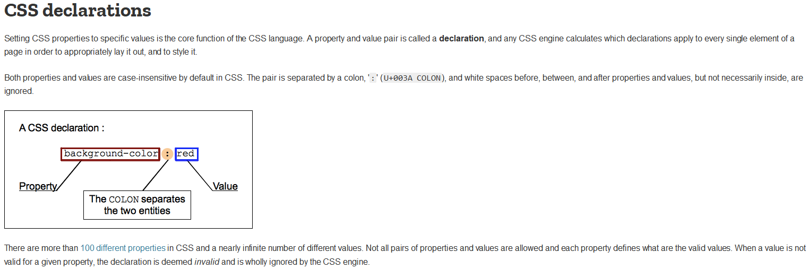

# CSS基础
## CSS简介和发展史
[W3C CSS 官方文档 https://www.w3.org/TR/css-2021/](https://www.w3.org/TR/css-2021/)

### CSS简介
CSS 是`“Cascading Style Sheet”`的缩写，中文意思为“层叠样式表”，它是一种标准的样式表语言，用于描述网页的表现形式（例如网页元素的位置、大小、颜色等）。

CSS 的主要作用是定义网页的样式（美化网页），对网页中元素的位置、字体、颜色、背景等属性进行精确控制。CSS 不仅可以静态地修饰网页，还可以配合 JavaScript 动态地修改网页中元素的样式，而且市面上几乎所有的浏览器都支持 CSS。


### CSS发展史
[https://css-tricks.com/look-back-history-css/](https://css-tricks.com/look-back-history-css/)

上世纪 90 年代蒂姆·伯纳斯·李（Tim Berners-Lee）发明万维网，创造 HTML 超文本标记语言。此后网页样式便以各种形式存在，不同的浏览器有自己的样式语言来控制页面的效果，因为最原始的 Web 版本中根本没有提供一种网页装饰的方法。


**CSS诞生**

在HTML迅猛发展的 90 年代，不同的浏览器根据自身的 HTML 语法结构来支持实现不同的样式语言。在最初的 HTML 版本中，由于只含有很少的显示属性，所以用户可以自己决定显示页面的方式。

但随着 HTML 的发展，HTML 增加了很多功能，代码也越来越臃肿，HTML 就变得越来越乱。网页也失去了语义化，维护代码很艰难，因为代码很混乱：


于是装饰网页样式的 CSS（层叠样式表，Cascading Style Sheets）诞生了。

**CSS语法确定**

早期 CSS 的语法设计看上去类似后来的 JavaScript 语法（当时 JavaScript 尚未存在），实际上，CSS 的这个写法借鉴了 X11 Window System 中的 X 资源。


在第一稿建议中，有一个影响百分比的说明符：h1.font.size = 20pt 80%。

行尾百分比的作用是想要通过这个百分比来控制该值的权重，如字号设置为 20pt，权重设置 80%，最终将字号值与权重组合在一起，值为 16pt。

这个写法的设计初衷是想将开发者与用户的要求与偏好组合到一起，CSS 之父哈肯·维姆·莱（Håkon Wium Lie） 提议 CSS 应该有一把滑尺，这样开发者与用户都有完全的控制力。当时这个提议引起了大家的讨论，但由于这个办法对如 font-size 等属性管用，但对另一些属性如 font-family 就不好用了，所以最终这个百分比的用法还是被舍弃了。

至于 CSS 的语法由 font.size 改成font-size，是怎么设计来的呢？首先，连字符读起来更像书面英语，简单易懂。其次，DSSSL（Document Style Semanticsand Specification Language，文档样式语义和规范语言） 和 DSSSL-Lite就使用这种连字符属性名。于是，CSS 也从中借鉴了连字符。

经过多年的努力 ，到1996年底，最终CSS语法变成了现在这个样子：


### CSS历史大事件

1994 年，Håkon Wium Lie 最初提出了 CSS 的想法，联合当时正在设计 Argo 的浏览器的Bert Bos，他们决定一起合作设计 CSS，于是创造了 CSS 的最初版本。

紧接着，他们在芝加哥的Mosaic and the Web 大会上第一次正式提出了 CSS 的建议，1995 年他们一起再次展示了这个建议。当时 W3C 刚刚建立，W3C 对 CSS 很感兴趣，为此专门组织了一次讨论会。

1996 年 12 月，W3C 推出了 CSS 规范的第一版本。

1997 年，W3C 颁布 CSS1.0 版本 ，CSS1.0 较全面地规定了文档的显示样式，可分为选择器、样式属性、伪类 / 对象几个部分。

这一规范立即引起了各方的关注，随即微软和网景公司的浏览器均能支持 CSS1.0，这为 CSS 的发展奠定了基础。

1998 年，W3C 发布了 CSS 的第二个版本，目前的主流浏览器都采用这标准。

CSS2 的规范是基于 CSS1 设计的，包含了 CSS1 所有的功能，并扩充和改进了很多更加强大的属性。包括选择器、位置模型、布局、表格样式、媒体类型、伪类、光标样式。

2005 年 12 月，W3C 开始 CSS3 标准的制定

2001年5月份，w3c发布了第三个css3.0（层叠样式表）版本，css3.0开始遵循模块化开发，该标准将整个网页系统划分为很多的相互独立的子模块，然后让程序员根据不同的模块进行开发与设计对应的层叠样式表，用来减少css文件的体积。

## css使用方式

### css 行内样式
行内样式就是在开始标签内部使用`style`进行css属性样式的定义,多个样式之间使用分号`;`隔开,行内css只能对于当前的标签的css影响,当样式的属性
名称相同的时候,行内样式 也会覆盖,外部样式和内部样式

```html
<!DOCTYPE html>
<html>
	<head>
		<meta charset="utf-8">
		<title></title>
	</head>
	<body>
		<p style="color:red;font-size: 18px;">CSS is the language for describing the presentation of Web pages, including colors, layout, and fonts. It allows one to adapt the presentation to different types of devices, such as large screens, small screens, or printers.</p>
	</body>
</html>
```
### css 内部样式

内部样式在页面的开始部分,`head标签内部`,使用`style`标签,再在`style`标签内部进行css样式属性的定义,内部样式会覆盖外部样式,行内样式会覆盖内部样式.一般首先使用外部的样式定义整体
网站的css样式,在使用内部样式对当前页面的个别标签进行定义

```html
<!DOCTYPE html>
<html>
	<head>
		<meta charset="utf-8">
		<title></title>
		<style>
			p{
				color:red;
				font-size: 18px;
			}
		</style>
	</head>
	<body>
		<p >CSS is the language for describing the presentation of Web pages, including colors, layout, and fonts. It allows one to adapt the presentation to different types of devices, such as large screens, small screens, or printers.</p>
		<p >CSS is the language for describing the presentation of Web pages, including colors, layout, and fonts. It allows one to adapt the presentation to different types of devices, such as large screens, small screens, or printers.</p>
	</body>
</html>
```
### css 外部样式(连接样式)
将多个页面的网站的样式几种在一个单独的后缀名为`.css`的样式表文件中,这样在多个页面在使用`link`
标签就可有引入相同的样式了,后边网站样式需要修改值需要修改样式表中的样式那么整个网站的所有引用相同样式表的所有
页面的样式都会发生变化

**style.css**
```css
p{
	color:red;
	font-size: 18px;
}
```
```html
<!DOCTYPE html>
<html>
	<head>
		<meta charset="utf-8">
		<title></title>
	<link rel="stylesheet" href="style.css" type="text/css">
	</head>
	<body>
		<p >CSS is the language for describing the presentation of Web pages, including colors, layout, and fonts. It allows one to adapt the presentation to different types of devices, such as large screens, small screens, or printers.</p>
		<p >CSS is the language for describing the presentation of Web pages, including colors, layout, and fonts. It allows one to adapt the presentation to different types of devices, such as large screens, small screens, or printers.</p>
	</body>
</html>
```

### css 导入样式(@import)
使用`@import`必须在其他样式使用之前首先导入,不然不会起作用,`@import`导入的样式在页面被加载完成以后才会进行渲染
```html
<!DOCTYPE html>
<html>
	<head>
		<meta charset="utf-8">
		<title></title>
		<style>
			@import url('https://g.alicdn.com/??tbhome/taobao-2021/0.0.34/lib/style/page-min.css,tbhome/taobao-2021/0.0.34/lib/style/index-min.css');
		</style>
	</head>
	<body>
		<p >CSS is the language for describing the presentation of Web pages, including colors, layout, and fonts. It allows one to adapt the presentation to different types of devices, such as large screens, small screens, or printers.</p>
		<p >CSS is the language for describing the presentation of Web pages, including colors, layout, and fonts. It allows one to adapt the presentation to different types of devices, such as large screens, small screens, or printers.</p>
	</body>
</html>
```
### css的几种使用方式的优先级

行内样式表 > 内部样式表>外部样式表

### css 命名规则

[W3C Css 语法规则 https://www.w3.org/TR/css-syntax-3/](https://www.w3.org/TR/css-syntax-3/)


CSS 规则由选择符和声明两部分组成，其中选择符用于指出规则所要选择的元素,声明则又由两部分组成：属性和值。属性指出
要影响元素哪方面的样式，值就是属性的一个新状态。

### 查看浏览器支持css的网站

[https://caniuse.com/](https://caniuse.com/)


## css注释
css 注释分为单行注释和多行注释,但是不同于其他的语言,css单行和多行都是使用`/*注释的内容*/`
+ 多行注释
+ 单行注释 
```html
/*定义网页的头部样式*/
.head{
    width: 960px;
}
/*定义网页的底部样式*/
.footer 
    {width:960px;
}
```
